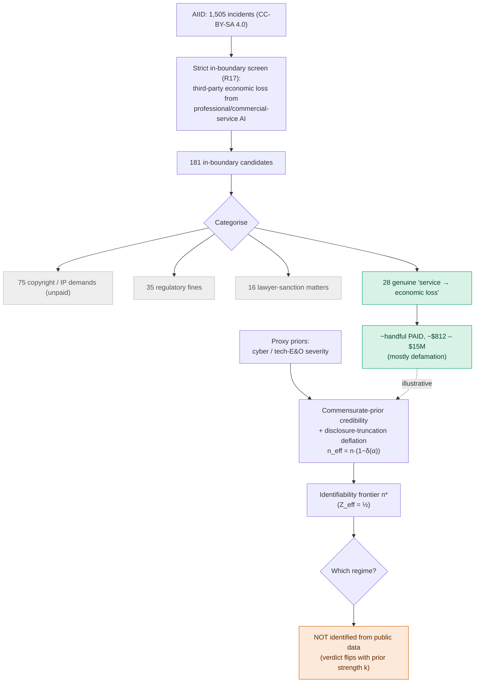
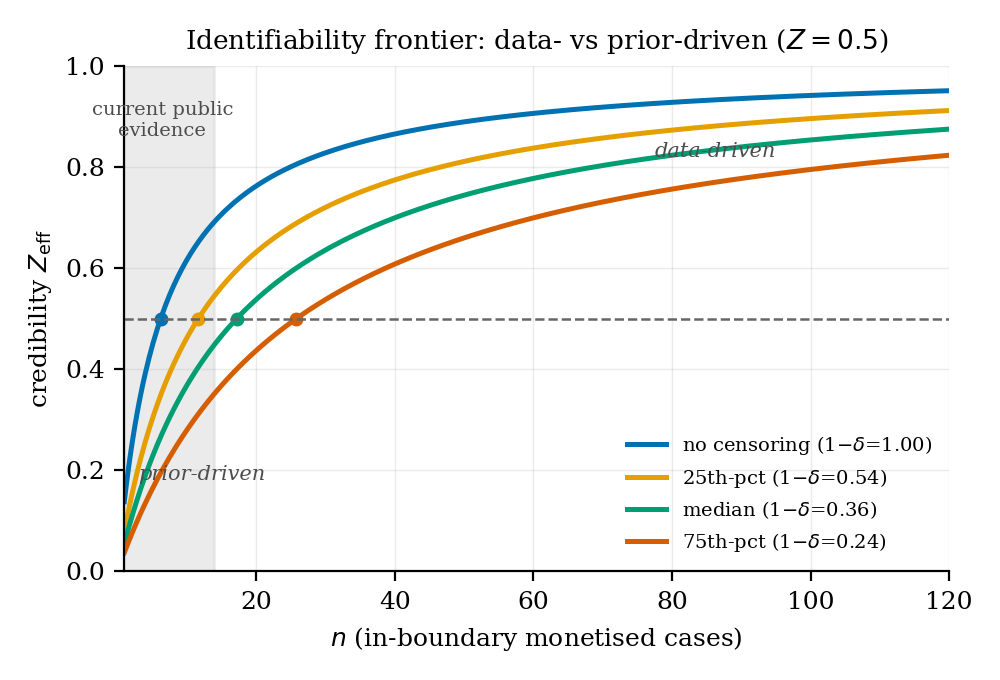
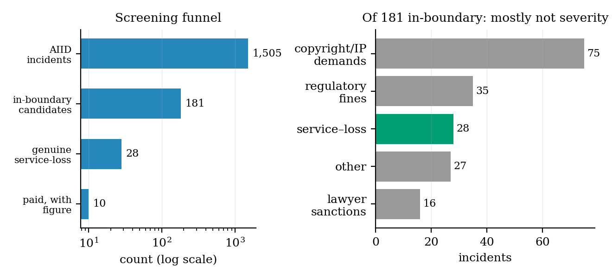
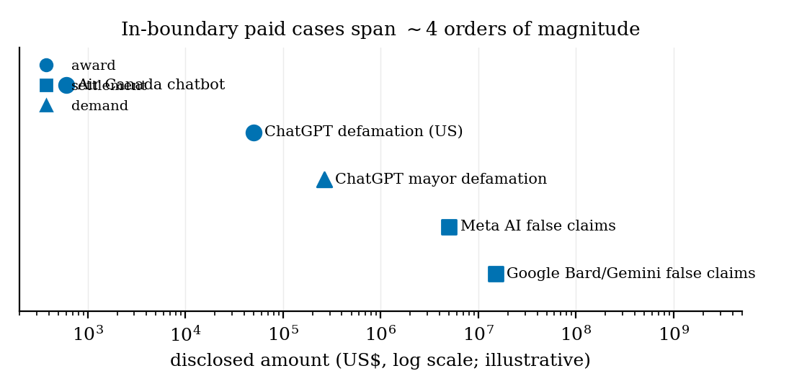

# Emerging Liability Severity Under Sparse Claims

**Author:** Tayyub Yaqoob (Independent Researcher) · 📄 **[Read the paper (PDF)](paper/main.pdf)**

Pricing **emerging-risk severity** before a mature claims history exists, framed as a question of
**identifiability**: *when does a data-poor line's severity posterior transition from prior-driven
to data-driven?* The method (credibility + truncated-normal information + the lognormal limited
expected value) is standard; the contribution is the **identifiability frontier** and the empirical
localisation, with an application to AI-system liability.

> **Status: working draft.** Headline finding is a **negative** one: public AI-liability loss
> experience is too sparse, heterogeneous, and selection-distorted to displace a proxy prior, so the
> prior-/data-driven regime is **not identified** from current public data. There is **no verified
> loss dataset and no deployable rate**; the case set is illustrative and labelled as such.
> Target venue: an applied actuarial outlet (*Variance* / *Risks*).

## Method architecture



## Key figures

**The identifiability frontier**: credibility `Z_eff` vs sample size `n` by disclosure-censoring
level; the `Z=½` line is the prior-/data-driven boundary, and current public evidence sits in the
prior-driven region.



**The screening funnel**: of 181 in-boundary candidates, the overwhelming majority are copyright
demands, fines, or lawyer-sanction matters; only ~28 are genuine service-loss, and fewer still carry
a paid figure. This sparsity is the empirical result.



**Severity heterogeneity**: the handful of in-boundary paid cases span ~4 orders of magnitude and
are dominated by defamation, which is why a severity distribution cannot be calibrated from them.



## Repository layout

```
paper/ main.tex · main.pdf · make_figures.py · figures/ (PDF + PNG)
theorem/ zeff_derivation.md · validate_zeff.py (closed form vs grid posterior, max err 0.006)
priors/ proxy_priors.py (lognormal priors from published cyber/E&O statistics)
labelling/ protocol.md · build_full_dataset.py · focused_verification.py
data/derived/ ai_liability_severity_dataset.csv (181 candidates) · focused_verification.csv
NOTICE CC-BY-SA attribution (AIID / AIAAIC)
```

## Data sources & licensing
Incident data derives from the **AI Incident Database (AIID)** and **AIAAIC Repository**, both
**CC-BY-SA 4.0**; derived data here is shared under CC-BY-SA 4.0 with attribution (`NOTICE`). The raw
~90 MB AIID snapshot is not included: regenerate from `incidentdatabase.ai/research/snapshots/`.
Content derived from the AIID report `text` field is excluded (not CC-BY-SA). **Every dataset row is
flagged `NEEDS PRIMARY-SOURCE CONFIRMATION`; the figures are a screen, not verified severity data.**

## Reproducing
Python 3.12 + `numpy scipy pandas matplotlib`; `tectonic` (or any TeX) for the paper.
```
python theorem/validate_zeff.py # validates the closed-form result
python labelling/build_full_dataset.py # rebuilds the in-boundary screen (needs the AIID snapshot)
python paper/make_figures.py # regenerates figures (PDF + PNG)
tectonic -X compile paper/main.tex # builds the PDF
```
